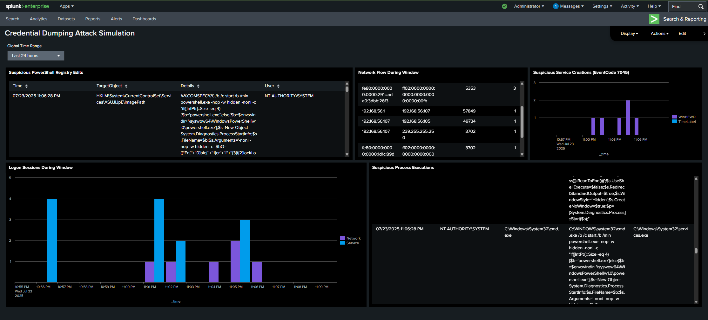

<h1 align="center">🛡️ SOC Analyst Home Lab</h1>

A fully virtualized detection lab simulating real-world cyberattacks to learn blue team defense, log analysis, and threat hunting using Splunk, Sysmon, Suricata, and the MITRE ATT&CK framework.

  
  
  
  
  

---

## 📌 Project Overview

This project is a home lab designed to demonstrate practical blue team cybersecurity skills for entry-level SOC Analyst roles. It simulates real-world attack techniques inside a safe, isolated virtual environment using:

- Endpoint logging (Windows + Sysmon)
- Network traffic analysis (Suricata)
- Centralized SIEM (Splunk)
- MITRE ATT&CK mapping for detection coverage

---

## 🔧 Lab Architecture

| Component          | OS              | Purpose                                      |
|--------------------|-----------------|----------------------------------------------|
| 💻 SIEM Server     | Ubuntu Server   | Hosts Splunk Enterprise (Free Trial)         |
| 🪟 Target Endpoint  | Windows 10/11   | Sysmon + Splunk Universal Forwarder          |
| 🧑‍💻 Attacker VM    | Kali Linux      | Attack simulation with Metasploit, etc.      |
| 🌐 NIDS VM         | Ubuntu Server   | Runs Suricata + Splunk Forwarder             |

> 🔒 All VMs are configured in **Host-Only Networking** for safe and controlled simulation.

---

## 🛠️ Technologies Used

- **Splunk Enterprise** (SIEM)
- **Splunk Universal Forwarder**
- **Sysmon** (Endpoint Visibility)
- **Suricata** (Network IDS)
- **MITRE ATT&CK Framework**
- **Kali Linux / Metasploit**
- **Windows Event Logs**
- **Custom Dashboards & Alerts**

---

## 🧪 Credential Dumping Attack Simulation

### Attack Overview

This section simulates a **credential dumping attack** on the Windows VM using the **Mimikatz/Kiwi** tool executed via an obfuscated PowerShell payload launched from the Kali Linux attacker VM. The attack attempts to dump credentials from the Local Security Authority Subsystem (LSASS) process, a common tactic used by attackers to escalate privileges and move laterally within a network.

### Detection Strategy

To detect this attack, multiple logs and event types are correlated within Splunk:

- **Suspicious PowerShell Registry Edits:** Identifies obfuscated commands modifying registry keys to establish persistence and disable security logging.  
- **Malicious Service Creations (EventCode 7045):** Detects attacker-installed services created during the attack timeframe for persistence.  
- **Execution Timeline of Credential Dumping Tools:** Tracks execution of tools like mimikatz, kiwi, and related PowerShell commands to identify credential dumping activity.  
- **Logon Sessions During Attack Window:** Monitors successful logons during the attack period to detect possible lateral movement or unauthorized access.

### MITRE ATT&CK Mapping

| Technique ID | Technique Name                     | Description                                                  |
|--------------|----------------------------------|--------------------------------------------------------------|
| T1003        | Credential Dumping               | Attackers dump credentials from LSASS using mimikatz/kiwi.   |
| T1543        | Create or Modify System Process | Creation of malicious services for persistence.              |
| T1112        | Modify Registry                 | Obfuscated PowerShell edits to registry keys to hide activity.|
| T1078        | Valid Accounts                 | Unauthorized logons using compromised credentials.           |

## 🔐 Brute Force Attack Simulation

### Attack Overview

This section simulates a **Windows account brute force attack** using **Hydra** from the Kali Linux attacker VM. The tool systematically attempts multiple username and password combinations against the Windows VM over the RDP protocol, mimicking a real-world password spraying or credential guessing attack.

### Detection Strategy

The brute force attempt is detected by collecting and analyzing failed logon events from the Windows Event Log (`EventCode=4625`) and Suricata alerts:

- **Windows Event Logs (EventCode 4625):** Tracks repeated failed logins by source IP address during a short time window, showing suspicious brute force activity.
- **Time-Bound Logon Failure Spike:** A timechart visualizes logon failures occurring between 3:00 PM and 7:00 PM to isolate attack window.
- **Suricata IDS Alerts:** Detects unusual authentication attempts and flags signature-based brute force behavior.

### MITRE ATT&CK Mapping

| Technique ID | Technique Name | Description                                                     |
|--------------|----------------|-----------------------------------------------------------------|
| T1110        | Brute Force    | Repeated password guessing to gain access to valid credentials.|
| T1078        | Valid Accounts | Attempting access using guessed or stolen credentials.         |

